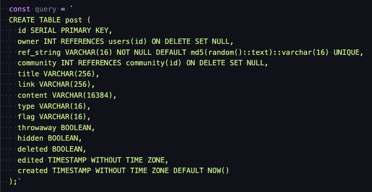
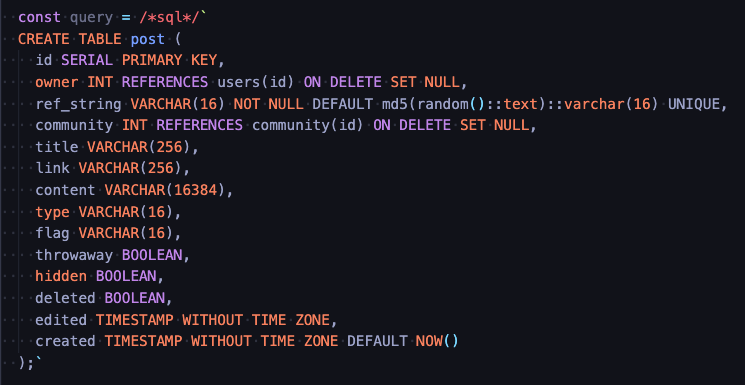

# VSCode Inline SQL Highlight

VSCode extension that highlights the SQL queries from your code if you have a ```/*sql*/``` comment in front of the string that contains SQL.

## Before


## After



